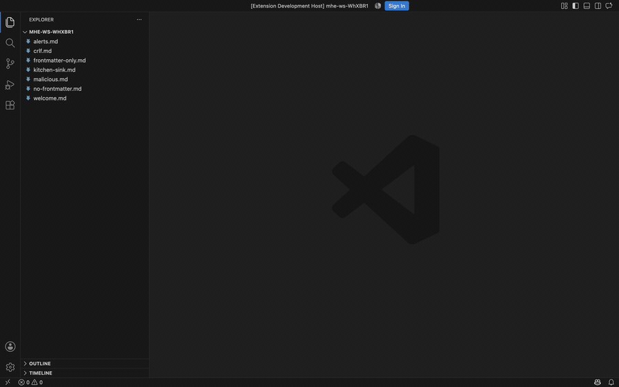

# Markdown Hybrid Editor

A hybrid markdown editor for VS Code. Markdown marks are hidden on every line the
caret is **not** on, so a note reads like prose but edits like source — no preview
pane, no mode switch, no second copy of the document.

Built on CodeMirror 6. Runs in VS Code desktop and in the browser
(vscode.dev, github.dev).



*A note reads as prose; the line under the caret shows its markdown.*
[Full walkthrough (4 min)](demo/out/walkthrough.mp4)

> **Status:** early. The editor works and is covered by automated gates, but it
> has not been through a release yet.

## What it does

- **Live preview inline.** Headings, `**bold**`, `*emphasis*`, `~~strikethrough~~`,
  `` `code` `` and `>` quotes lose their marks away from the caret and get them
  straight back on the line you are editing.
- **Links collapse to their text.** `[label](https://…)` reads as *label*; a bare
  `[label]` with no URL, like `app[bot]`, is left alone.
- **Tables render as tables, and edit in place.** Click a cell and it shows its raw
  markdown; type and the row is rewritten. Tab and Shift-Tab walk the cells.
- **Frontmatter folds** behind a one-row `3 properties` summary. Unfolded, it
  follows the same rule as the body: properties read as properties, with a guide
  per level of nesting, and the line under the caret shows its YAML.
- **A reading column** — serif body text, a capped line length, a real heading
  scale — or your normal editor font, if you prefer. Colours always follow your
  VS Code theme.

The file on disk is ordinary markdown throughout. This is a *view*, not a format.

## What you give up

A custom editor is not a text editor, so VS Code features that follow the active
text editor do not see these tabs. Worth knowing before you turn it on for every
`.md`:

| Lost | Notes |
|---|---|
| **Copilot and inline completions** | No mitigation. For many people this alone decides it. |
| Breadcrumbs, minimap, sticky scroll, folding | — |
| Outline view, Go to Symbol | Replaced by **Go to Heading…** (<kbd>⇧⌘O</kbd>) |
| <kbd>⌘F</kbd> find widget | Replaced by CodeMirror's own search panel on the same key |
| Ln/Col indicator | Replaced in the status bar, with a word count |
| Diagnostics squiggles (markdownlint) | Still reported in the Problems panel, just not drawn in the editor |
| SCM gutter marks | "Open Changes" still opens a normal diff, so review is unaffected |

You also **gain** spell check, since the webview uses the browser's.

### Turning it off

Every `.md` opens here by default. To go back for one file, use the
**Reopen in Text Editor** button in the editor title bar. To go back for good:

```jsonc
"workbench.editorAssociations": { "*.md": "default" }
```

## Settings

| Setting | Default | |
|---|---|---|
| `markdownHybridEditor.typography` | `reading` | `reading` for the serif column, `vscode` for your editor font at full width |
| `markdownHybridEditor.fontFamily` / `fontSize` / `lineHeight` / `readingMeasure` | — | Override the reading column |
| `markdownHybridEditor.frontmatter.collapsedByDefault` | `true` | One global preference: the toggle applies to every open editor |
| `markdownHybridEditor.livePreview.enabled` | `true` | Off shows raw markdown everywhere |
| `markdownHybridEditor.tables.render` | `true` | Off edits tables as markdown |
| `markdownHybridEditor.maxFileSize` | `1500000` | Larger documents open with a notice instead |

## Security

A markdown file is untrusted input — notes get cloned from strangers' repos and
written by agents — so the webview is given the least authority that still lets
CodeMirror run:

- `default-src 'none'`, with `img-src`, `font-src` and `connect-src` all `'none'`.
  Nothing in a note can make an outbound request.
- `script-src` is nonce-only, and `require-trusted-types-for 'script'` makes the
  browser enforce it.
- `enableCommandUris` and `enableForms` are off, and `localResourceRoots` is the
  extension's own `dist` — the workspace is never reachable through the webview.
- Document text is only ever written as DOM text nodes. `innerHTML` and friends
  are a lint error in every source directory, with unit tests pinning the
  behaviour.

`style-src` has to allow inline, because CodeMirror sets `style` attributes and a
nonce cannot cover those. With no network reachable, CSS has nowhere to send
anything.

## Development

```bash
pnpm install
pnpm verify      # lint, typecheck, unit tests, build
pnpm watch       # then F5 in VS Code
pnpm dev:web     # run it in a browser
```

`pnpm demo:gates` drives a real VS Code through Playwright and checks each
milestone end to end — typing reaches disk, undo is per burst not per keystroke,
two views of one document stay in step, CRLF survives a round trip, and a note
full of hostile markup executes nothing.

```bash
pnpm demo:record   # drive VS Code through the walkthrough, off-screen
pnpm demo:video    # frames -> walkthrough.mp4
pnpm demo:gif      # the first 34s as a GIF, for the README
```

The walkthrough doubles as acceptance evidence: every beat is a milestone gate,
so a green recording shows the features working rather than just rendering. It
records with the window parked off-screen — the screencast captures the
renderer, not the screen — so a three-minute run does not sit in front of
whatever else is happening. `MHE_FOREGROUND=1` shows it live while editing beats.

### Layout

```
src/editor/    CodeMirror only. Imports neither vscode nor the webview, so it is
               testable against a bare EditorState. Enforced by lint.
src/host/      The extension host. No Node builtins, so it also runs as a Web
               Worker in vscode.dev. Enforced by lint and a second tsconfig.
src/webview/   The browser half: mounts the editor, batches edits.
src/shared/    Types and helpers both bundles use.
```

## Before publishing

`vsce` rewrites the README's relative image links to absolute ones, which it can
only do once it knows where the extension lives. Add a `repository` field to
`package.json`, or pass the base URLs:

```bash
VSCE_BASE_IMAGES_URL=https://raw.githubusercontent.com/<user>/markdown-hybrid-editor/main \
VSCE_BASE_CONTENT_URL=https://github.com/<user>/markdown-hybrid-editor/blob/main \
pnpm package
```

The Marketplace strips `<video>`, so the GIF is what moves in the listing.

## Licence

MIT © 2026 Cedric Vidal
