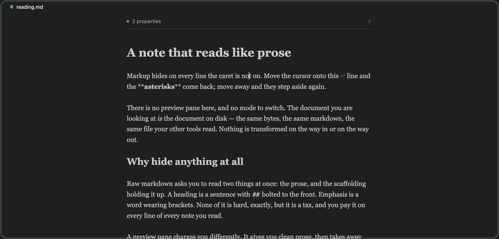
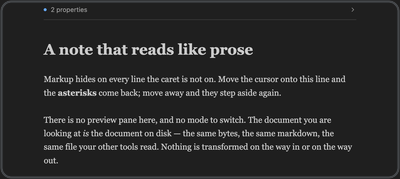
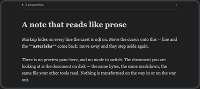
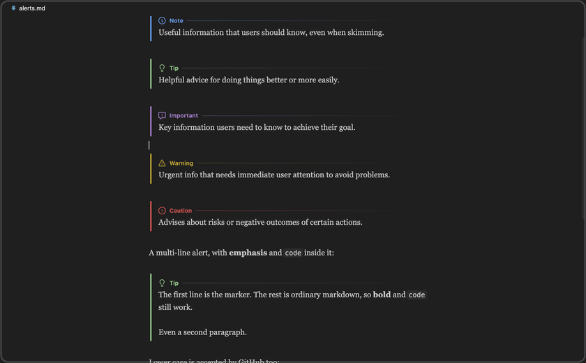
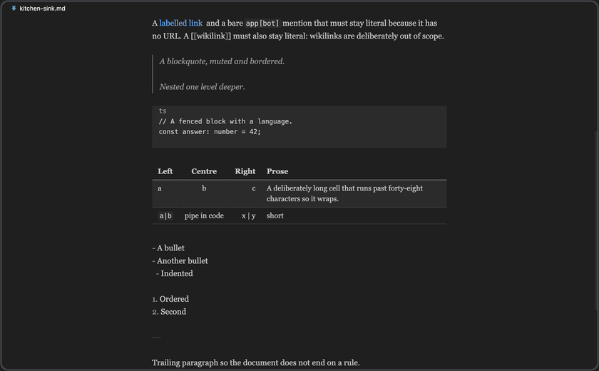
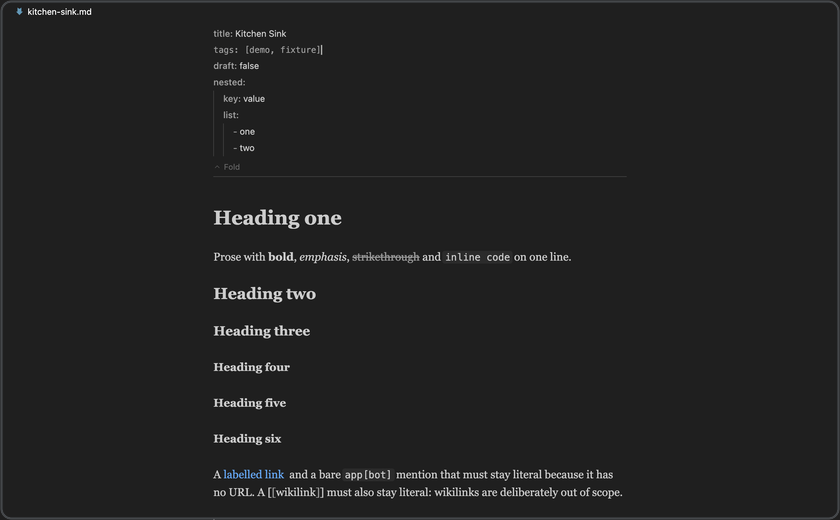
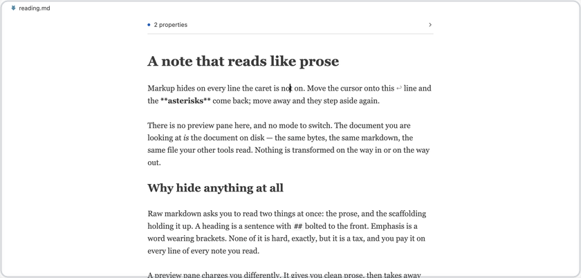

<p align="center">
  
</p>

<h1 align="center">Markdown Hybrid Editor</h1>

<p align="center">
  <em>Markdown marks hide on every line the caret is not on,<br>
  so a note reads like prose but edits like source.</em>
</p>

<p align="center">
  <a href="#install">Install</a>
  &nbsp;·&nbsp;
  <a href="#what-it-does">What it does</a>
  &nbsp;·&nbsp;
  <a href="#what-you-give-up">What you give up</a>
  &nbsp;·&nbsp;
  <a href="#settings">Settings</a>
</p>

<p align="center">
  <a href="https://github.com/cedricvidal/markdown-hybrid-editor/blob/HEAD/LICENSE"></a>
  <a href="https://code.visualstudio.com/"></a>
</p>

<p align="center">
  
</p>

<p align="center">
  <sub><em>A note reads as prose; the line under the caret shows its markdown.</em></sub>
</p>

---

No preview pane, no mode switch, no second copy of the document. Built on
CodeMirror 6.

> **Status:** early. The editor works and is covered by automated gates, but it
> has not been through a release yet.

## Install

Not on the Marketplace yet. Until it is, build and install it from source:

```bash
git clone https://github.com/cedricvidal/markdown-hybrid-editor.git
cd markdown-hybrid-editor
pnpm install
pnpm dev:install     # build, package, install into VS Code
```

Restart VS Code once. Every `.md` then opens here — see
[Turning it off](#turning-it-off) if you would rather it did not.

Requires VS Code 1.90 or newer. Runs on the desktop and in the browser
(vscode.dev, github.dev).

## What it does

- **Live preview inline.** Headings, `**bold**`, `*emphasis*`, `~~strikethrough~~`,
  `` `code` `` and `>` quotes lose their marks away from the caret and get them
  straight back on the line you are editing.
- **Soft breaks reflow.** A single newline inside a paragraph is a space in
  markdown, so a file hand-wrapped at 80 columns reads as flowing prose rather
  than ragged fragments. Edit a paragraph and each break shows as a quiet `↵`
  rather than the text springing back onto its source lines — you see where your
  newlines are without anything moving under the caret, and the paragraph shows
  its markup as a whole. Hard breaks, code fences and tables keep their breaks.
- **Links collapse to their text.** `[label](https://…)` reads as *label*; a bare
  `[label]` with no URL, like `app[bot]`, is left alone.
- **GitHub alerts** — `> [!NOTE]`, `[!TIP]`, `[!IMPORTANT]`, `[!WARNING]`,
  `[!CAUTION]` — are marked rather than boxed: a coloured rail down the passage
  and the name on a rule, in your theme's own colours. The prose keeps the
  reading face, and the marker shows its source under the caret.
- **Tables render as tables, and edit in place.** Click a cell and it shows its raw
  markdown; type and the row is rewritten. Tab and Shift-Tab walk the cells.
- **Frontmatter folds** behind a one-row `3 properties` summary. Unfolded, it
  follows the same rule as the body: properties read as properties, with a guide
  per level of nesting, and the line under the caret shows its YAML.
- **A reading column** — serif body text, a capped line length, a real heading
  scale — or your normal editor font, if you prefer. Colours always follow your
  VS Code theme.

<p align="center">
  
  
</p>

<p align="center">
  <sub><em>Put the caret on the line and the source comes straight back.</em></sub>
</p>

The file on disk is ordinary markdown throughout. This is a *view*, not a format.

<details>
<summary><strong>More of it</strong> — alerts, tables, frontmatter</summary>
<br>

<p align="center">
  
</p>

<p align="center">
  <sub><em>GitHub alerts are marked, not boxed — the prose stays prose.</em></sub>
</p>

<p align="center">
  
</p>

<p align="center">
  <sub><em>Tables render as tables, and edit in place.</em></sub>
</p>

<p align="center">
  
</p>

<p align="center">
  <sub><em>Frontmatter folds into one row. Unfolded, it follows the same rule as the body.</em></sub>
</p>

</details>

## Watch it work

<p align="center">
  
</p>

Every beat of that recording is also an acceptance criterion — it is driven
against a real VS Code by `pnpm demo:record`, so a green run is evidence the
feature works, not just that it renders.
[Full walkthrough (3 min 32 s)](demo/out/walkthrough.mp4)

## What you give up

A custom editor is not a text editor, so VS Code features that follow the active
text editor do not see these tabs. Worth knowing before you turn it on for every
`.md`:

| Lost | Notes |
|---|---|
| **Copilot and inline completions** | No mitigation. For many people this alone decides it. |
| Breadcrumbs, minimap, sticky scroll, folding | — |
| Outline view, Go to Symbol | Replaced by **Go to Heading…** (<kbd>⇧⌘O</kbd>) |
| <kbd>⌘F</kbd> find widget | Replaced by CodeMirror's own search panel on the same key |
| Ln/Col indicator | Replaced in the status bar, with a word count |
| Diagnostics squiggles (markdownlint) | Still reported in the Problems panel, just not drawn in the editor |
| SCM gutter marks | "Open Changes" still opens a normal diff, so review is unaffected |

You also **gain** spell check, since the webview uses the browser's.

### Turning it off

Every `.md` opens here by default. To go back for one file, use the
**Reopen in Text Editor** button in the editor title bar. To go back for good:

```jsonc
"workbench.editorAssociations": { "*.md": "default" }
```

## Settings

| Setting | Default | |
|---|---|---|
| `markdownHybridEditor.typography` | `reading` | `reading` for the serif column, `vscode` for your editor font at full width |
| `markdownHybridEditor.fontFamily` / `fontSize` / `lineHeight` / `readingMeasure` | — | Override the reading column |
| `markdownHybridEditor.frontmatter.collapsedByDefault` | `true` | One global preference: the toggle applies to every open editor |
| `markdownHybridEditor.livePreview.enabled` | `true` | Off shows raw markdown everywhere |
| `markdownHybridEditor.reflowParagraphs` | `true` | Join a paragraph's soft-wrapped lines, the way markdown renders them. Off keeps every source line on its own line |
| `markdownHybridEditor.softBreaks` | `mark` | While you edit a paragraph: `mark` shows a quiet `↵` and nothing moves, `unwrap` puts it back on its source lines |
| `markdownHybridEditor.tables.render` | `true` | Off edits tables as markdown |
| `markdownHybridEditor.maxFileSize` | `1500000` | Larger documents open with a notice instead |

<p align="center">
  
</p>

<p align="center">
  <sub><em>Colours always follow your VS Code theme. No reload, no second set of settings.</em></sub>
</p>

## Security

A markdown file is untrusted input — notes get cloned from strangers' repos and
written by agents — so the webview is given the least authority that still lets
CodeMirror run:

- `default-src 'none'`, with `img-src`, `font-src` and `connect-src` all `'none'`.
  Nothing in a note can make an outbound request.
- `script-src` is nonce-only, and `require-trusted-types-for 'script'` makes the
  browser enforce it.
- `enableCommandUris` and `enableForms` are off, and `localResourceRoots` is the
  extension's own `dist` — the workspace is never reachable through the webview.
- Document text is only ever written as DOM text nodes. `innerHTML` and friends
  are a lint error in every source directory, with unit tests pinning the
  behaviour.

`style-src` has to allow inline, because CodeMirror sets `style` attributes and a
nonce cannot cover those. With no network reachable, CSS has nowhere to send
anything.

## Development

```bash
pnpm install
pnpm verify      # lint, typecheck, unit tests, build
pnpm dev:web     # run it in a browser
```

### Using it in your own VS Code

```bash
pnpm dev:install   # build, package, install into VS Code
```

Restart VS Code once. After that, the loop for each change is:

```bash
pnpm dev:sync      # rebuild and copy into the installed extension
```

…then **Developer: Reload Window** (<kbd>⌘R</kbd>). Host-side changes need the
reload; webview-only changes need only the tab reopened.

> **Note** — a symlink in `~/.vscode/extensions` does **not** work. VS Code only
> loads extensions listed in that folder's `extensions.json`, which the installer
> writes — a hand-made folder or link there is ignored silently.

Note that `.md` files open in this editor once it is loaded — see
[Turning it off](#turning-it-off). `code --uninstall-extension
cedricvidal.markdown-hybrid-editor` removes it.

### A separate window instead

`pnpm watch`, then <kbd>F5</kbd>, which launches an Extension Development Host
with the extension loaded and leaves your own VS Code untouched.

### The README's own images

`pnpm icon:build` rasterises `media/icon.svg`. `pnpm demo:hero` re-captures every
still in `docs/media/` by driving a real VS Code with its chrome hidden, and
asserts what it photographs — a shot of "the marks come back under the caret" is
only taken once the rendered line has been read back and confirmed.

## Licence

MIT © 2026 Cedric Vidal
